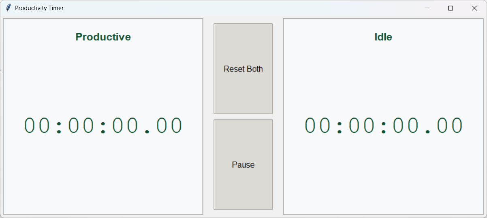
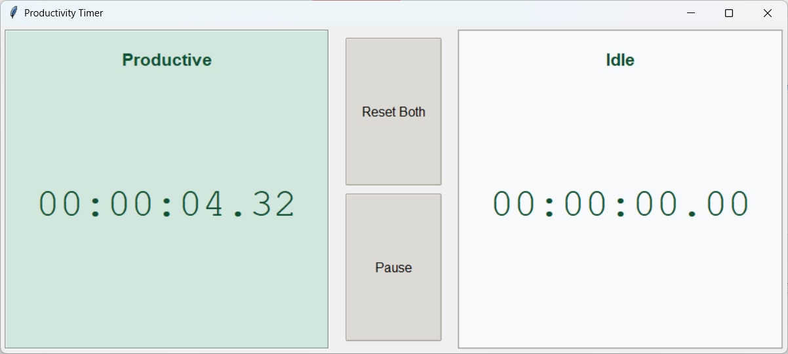
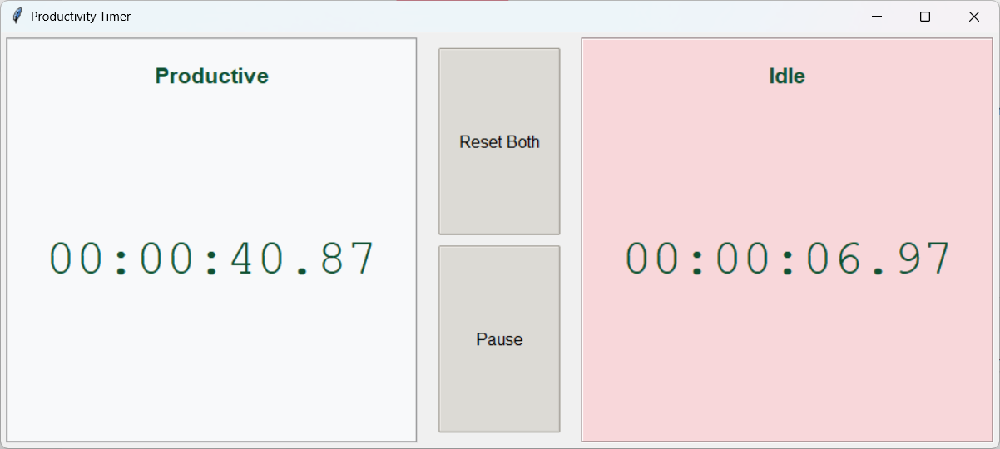

# Productivity Timer

A simple and elegant desktop application to track your productive and idle time, helping you stay focused and aware of your work patterns.





## ✨ Features

- **Dual Timers:** Separate stopwatches for "Productive" and "Idle" time.
- **One-Click Switching:** Simply click on a timer to start it and automatically pause the other.
- **Visual Cues:** The active timer is highlighted with a distinct color, so you always know which one is running.
- **Essential Controls:** Easily pause the active timer or reset both timers to zero.
- **Clean Interface:** A minimalist and distraction-free design built with Tkinter.

## 🚀 How to Use

1.  **Run the application.**
2.  Under the "dist" folder there is the executable. Simply double click it to run the application.
2.  Click on the **Productive** timer to start tracking your work.
3.  When you take a break, click on the **Idle** timer. This will pause the "Productive" timer and start the "Idle" one.
4.  Click the **Pause** button to stop whichever timer is currently active.
5.  Click the **Reset Both** button to clear both timers and start fresh.

## 🛠️ Getting Started

### Prerequisites

- Python 3.x

The application uses `tkinter`, which is part of the standard Python library, so no external packages are needed to run it from the source.

### Running from Source

Clone this repository or download the source code and run the following command in the project directory:

```bash
python main.py
```

## 📦 Building an Executable

You can create a standalone executable file using `PyInstaller`.

1.  **Install PyInstaller**:
    ```bash
    pip install pyinstaller
    ```

2.  **Create the Executable**:
    Run the following command in your terminal. This will create a single, windowed executable file named `Productivity Timer.exe` with a custom icon. Make sure you have an icon file named `clock.ico` in the same directory.

    ```bash
    pyinstaller --onefile --windowed --name "Productivity Timer" --icon=clock.ico main.py
    ```